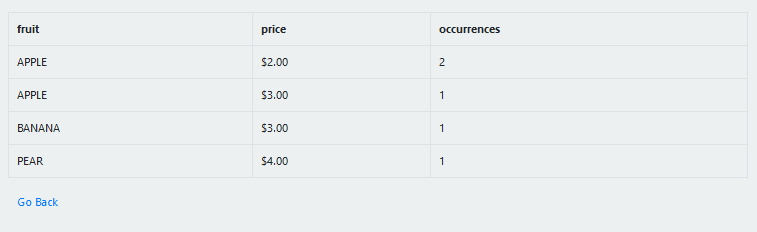

# regex-sql

A web based tool written in PHP to parse structured or unstructured text data into a single session database using Sqlite so it can be quried with SQL.

The concept is similar to AWS Athena.

## Tool UI

### Tool UI Sections

|     Section    |                                       Description                                       |                                            Example                                           |
|:--------------:|:---------------------------------------------------------------------------------------:|:--------------------------------------------------------------------------------------------:|
| Data           | Raw text which can may be pasted or uploaded using a file                               | APPLE $2.00 APPLE $3.00 BANANA $3.00 APPLE $2.00 PEAR $4.00                                  |
| Regex          | The regular expression to define the structure using capture groups; round brackets: () | `/([A-Z]+)\s(\$\d+\.\d{2})/`                                                                   |
| SQL Query      | A SQL select statement based on the other sections                                      | `SELECT fruit, price, COUNT(*) as occurrences FROM fruit_price_history GROUP BY fruit, price;` |
| Table Name     | The table name                                                                          | fruit_price_history                                                                          |
| Capture Groups | Map Regex Capture Group indices to MySql columns                                        | fruit VARCHAR(32) price FLOAT                                                                |

## Output UI

## Demo

http://indie.kiwi/regex-sql/
